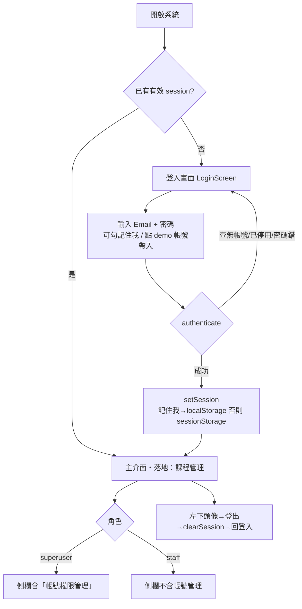
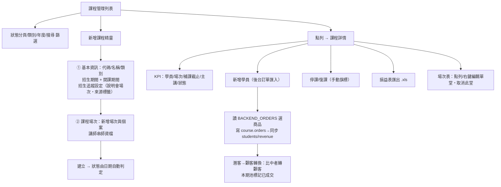
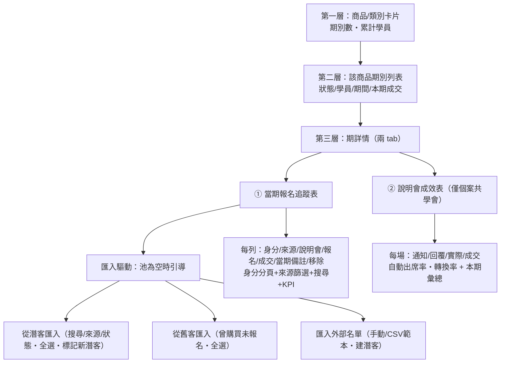
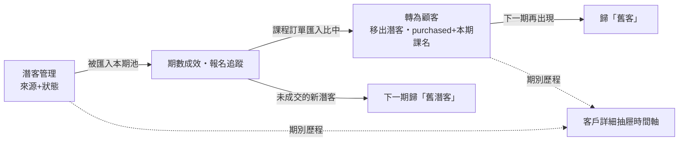
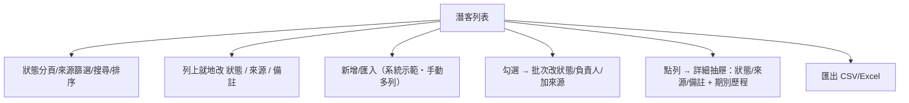
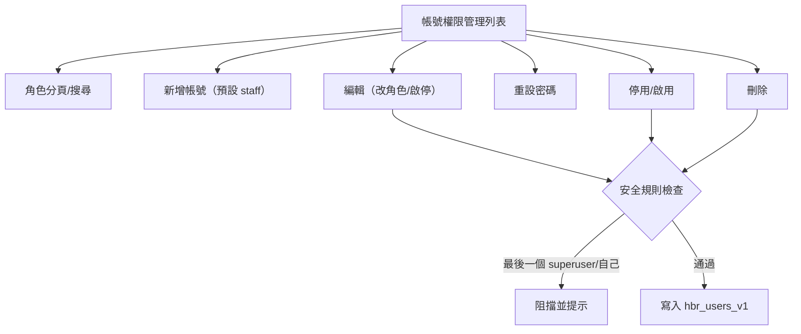

# 課務 CRM 系統 — 使用者流程圖
> **撰寫：Agent B（UX）** ｜ 版本 v1.0 ｜ 流程以 Mermaid 描述，對應原型實作

> 在支援 Mermaid 的檢視器（GitHub、VS Code Mermaid、Typora）可直接渲染。

---

## 0. 全域進入流程（登入閘門）

## 1. 課程管理流程

## 2. 期數成效管理流程（三層）

## 3. 潛客 → 顧客 生命週期

## 4. 潛客管理操作流程

## 5. 帳號權限管理流程（僅 superuser）

